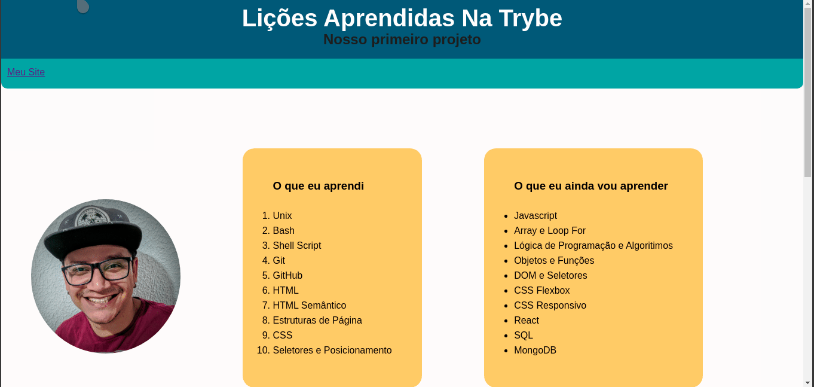
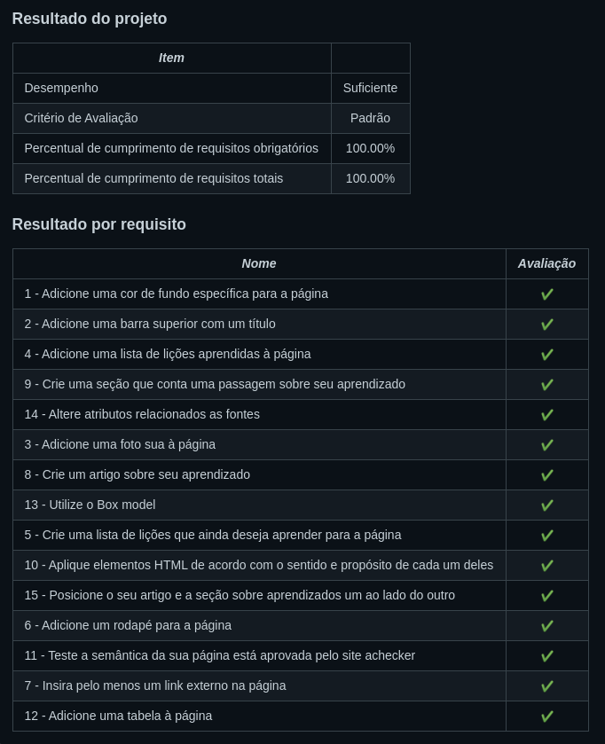

# 🚀️ Projeto realizado no final do bloco 3

## 💚️ Resultado 💚️

---
## Habilidades

Neste projeto, você será capaz de:

* Utiizar _HTML_ para construir páginas WEB.
* Utilizar _HTML_ semântico para tornar sua páigna mais acessível e melhor ranqueada.
* Utilizar _CSS_ para adicionar estilo e posicionar elementos.

---
### Lista de requisitos

⚠️ Leia-os atentamente e siga à risca o que for pedido. Em particular, **atente-se para os nomes de _ids_ que alguns elementos de seu projeto devem possuir**. ⚠️

O não cumprimento de um requisito, total ou parcialmente, impactará em sua avaliação.

### 1. Adicione uma cor de fundo específica para a página

Possuir cor de fundo: rgb(253, 251, 251)

**O que será verificado:**

- Possuir cor de fundo: rgb(253, 251, 251)

### 2. Adicione uma barra superior com um título

A barra deve possuir o ID "cabecalho" e deve ser fixa no topo da página com a propriedade top tendo **0px**. O título deve estar dentro da barra e ser um elemento **h1** com ID "titulo".

**O que será verificado:**

- A barra possui o ID "cabecalho"
- A barra superior deve ser fixa no topo da página, com a propriedade top tendo `0px`
- O título deve estar dentro da barra e possuir o ID "titulo", além de ser uma tag "h1"

### 3. Adicione uma foto sua à página

A foto deve ser inserida utilizando uma tag **img** com o ID "minha_foto".

**O que será verificado:**

- A foto deve ser inserida utilizando uma tag img com o ID "minha_foto"

### 4. Adicione uma lista de lições aprendidas à página

A lista deve possuir **10** itens, ser numerada e possuir o ID "licoes_aprendidas".

**O que será verificado:**

- A lista deve ser numerada e possuir o ID "licoes_aprendidas"
- A lista deve possuir 10 itens

### 5. Crie uma lista de lições que ainda deseja aprender para a página

A lista deve possuir **10** itens, não ser numerada e possuir o ID "licoes_a_aprender".

**O que será verificado:**

- A lista não deve ser numerada e deve possuir o ID "licoes_a_aprender"
- A lista deve possuir 10 itens

### 6. Adicione um rodapé para a página

O rodapé deve utilizar a tag **footer** e possuir o ID "rodape".

**O que será verificado:**

- O rodapé deve possuir o ID "rodape"

### 7. Insira pelo menos um link externo na página

A configuração desse link deve ser feita para abrir em uma nova aba do navegador

**O que será verificado:**

- A configuração desse link deve ser feita para abrir em uma nova aba do navegador

### 8. Crie um artigo sobre seu aprendizado

O artigo deverá possuir mais de 300 **caracteres** e menos de 600, além disto deve possuir a tag **article**.

**O que será verificado:**

- A `tag` `article` devem ser utilizadas
- O artigo deve ter mais de 300 letras e menos de 600

### 9. Crie uma seção que conta uma passagem sobre seu aprendizado

A seção deverá possuir mais de 100 **caracteres** e menos de 300, além disto deve possuir a tag **aside**.

**O que será verificado:**

- A `tag` `aside` deve ser utilizada
- A seção deve ter mais que 100 letras e menos que 300

### 10. Aplique elementos HTML de acordo com o sentido e propósito de cada um deles

Para tornar o seu site mais acessível e melhorar seu ranqueamento em mecanismos de busca na Web, sua página deve conter os seguintes elementos: article, header, nav, section, aside e footer.

**O que será verificado:**

- Validar se a página possui um elemento "article"
- Validar se a página possui um elemento "header"
- Validar se a página possui um elemento "nav"
- Validar se a página possui um elemento "section"
- Validar se a página possui um elemento "aside"
- Validar se a página possui um elemento "footer"

### 11. Teste a semântica da sua página está aprovada pelo site achecker

Teste a semântica da sua página está aprovada pelo site achecker

**O que será verificado:**

- Seu site deve passar sem problemas na verificação de semântica do site achecker

### BÔNUS

### 12. Adicione uma tabela à página

**O que será verificado:**

- A página deve possuir uma tabela

### 13. Utilize o Box model

Altere **margin**, **padding** e **border** dos elementos para ver, na prática, como esses atributos influenciam e melhoram a visualização dos componentes.

**O que será verificado:**

- Altere `margin`, `padding` e `border` dos elementos para ver, na prática, como esses atributos influenciam e melhoram a visualização dos componentes

### 14. Altere atributos relacionados as fontes
Modifique o estilo da sua tipografia alterando o tamanho de letra, a cor, o espaçamento entre as linhas e a **font-family**.

**O que será verificado:**

- Altere o tamanho da letra
- Altere a cor da letra
- Altere o espaçamento entre as linhas
- Altere o `font-family`

### 15. Posicione o seu artigo e a seção sobre aprendizados um ao lado do outro

Adicione ao elemento posicionado no lado esquerdo a classe "lado-esquerdo" e ao elemento posicionado no lado direito a classe "lado-direito"

**O que será verificado:**

- Utilizar a classe "lado-esquerdo"
- Utilizar a classe "lado-direito"
- Verificar se os elementos com as classes lado-direito e lado-esquerdo estão posicionados corretamente

---